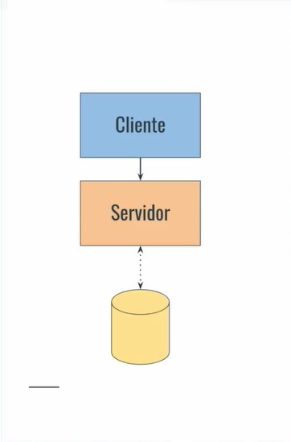
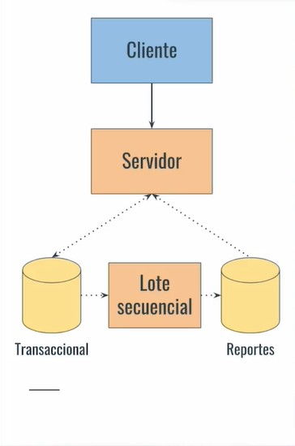

# JP Services
## Trigger
Estamos bañandonos y de pronto haciendo algo y se rompe la tubería del agua o se daña algo de la madera de un mueble.

## &nbsp;&nbsp;&nbsp; Pregunta
>¿Como encontramos un plomero o un carpintero de confianza?

>¿Como podemos encontrar un técnico o profesional de confianza?
---
## Análisis de requerimientos
## Criterios de éxito
- Conectar rápidamente a un cliente con un profesional de confianza
- Garantizar el aumento de volúmen de trabajo al profesional

## Historias de usuario
1. Como **cliente** necesito ***contactar un profesional en el momento*** para reparar un problema en mi hogar
2. Como **cliente** necesito ***conocer la experiencia del profesional*** para decidir a cuál contacto
3. Como **profesional** necesito ***cobrar mi trabajo realizado*** para continuar prestando el servicio
4. Como **progesional** necesito ***ampliar mi cartera de clientes*** para tener más flujo de trabajo

## Requerimientos
### Ciclo de prestación del servicio:
Solicitar, acepatar y finalizar una prestación de servicio de forma segura

### Comunicación
Capacidad de busqueda y comunicación rápida entre clientes y profesionales disponibles

### Evaluación
Capacidad de evaluar profesionales y clientes para referencia futura

----
## Riesgos
- Un **cliente** utiliza un servicio y ***no completa el pago*** en un tiempo determinado
- un **profesional** llegó a la puerta de mi casa y ***no puedo confirmar que sea quien dice que es***
- El **proyecto** ***no está terminado*** para la feria de Profesionales Independientes de 2023 o para x o y fecha

## Restricciones
- Recursos disponibles para el desarrollo
- Registro de impuestos del profesional
- Garantía de profesionales sin antecedentes penales
---
## Estilo arquitectónico
**Cliente - Servidor**  

---
---
## Si el producto esta creciendo...
## Nuevos cristerios de éxito
- Brindar a las empresas cliente **estabilidad y control de costos** de las prestaciones de servicios que necesiten
- Brindar a las empresas prestadoras una **visión de crecimiento** de sus servicios

## Nuevas Historias de usuario
1. Como **empresa cliente** necesito ***reportes de gastos en servicios*** para controlar y entender mis finanzas
2. Como **empresa cliente** necesito ***generar listas de profesionales preferidos*** para nunca perder la disponibilidad del servicio
3. Como **empresa prestadora** necesito ***medir el rendimiennto de mis profesionales*** para comprender mi propio crecimiento
4. Como **empresa prestadora** necesito ***posicionarme como la mejor empresa del mercado*** para obtener más clientes

## Nuevos Requerimientos
### Reportes:
- Reportes de gastos por período y por tipo de servicio contratado.
- Reporte de ingresos y horas trabajadas por profesional por período y tipo de servicio prestado.

### Autorización:
- Gestión de usuarios, roles y permisos asociados a acciones del sistema

### Posicionamiento y comunicación:
- Ranking de prestadores por evaluación
- Lista priorizada de prestadores por tipo de prestación.

---
## Riesgos
- Las **empresas cliente** ***no pueden extraer la información del sistema*** para integrarlo en sus aplicaciones
- Los indicadores de la **empresa prestadora** ***no son indicativos del trabajo realizado***
- El **proyecto** podría recibir ***juicios a fraude*** por cobros injustificados.

## Restricciones
- Conformar a estándares de auditoría profesional
- Garantizar la privacidad de los datos de consumo

---
## Estilo arquitectónico
**Cliente - Servidor**
    Con **lote secuencial** para la bases de datos transaccional pasarla a una de reportes y así no fatigar el sistema con las lecturas y los cálculos.  

